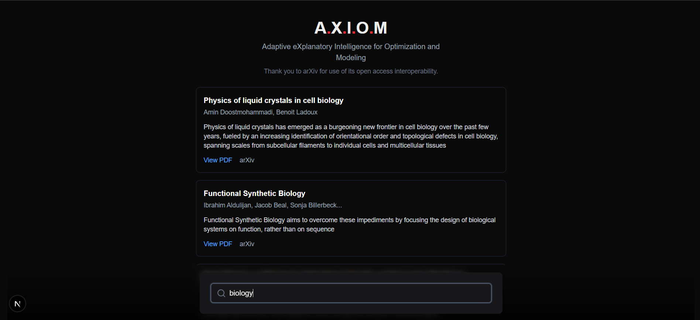
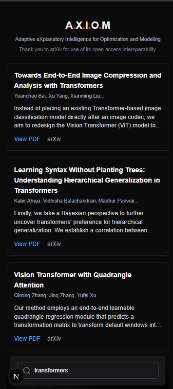

# A.X.I.O.M. (Paper Intelligence)

A production-grade, asynchronous Full-Text Search engine and ingestion pipeline for scientific papers from the arXiv API. 

This project implements an elite "Read-Through Cache" architecture: when a user searches for a topic, the system instantly queries a mathematically-ranked PostgreSQL GIN index. If the topic has never been searched before, the backend seamlessly reaches out to the arXiv API, ingests the latest papers, chunks their abstracts, builds the search vectors, and returns the results—all in real-time.

## 📸 Interface Preview

### Desktop View


### Mobile View


## 🚀 Key Features Implemented (Phase 1)

*   **Asynchronous Ingestion Pipeline:** Uses `httpx` and `xml.etree` to asynchronously fetch and parse Atom/XML feeds from the arXiv API.
*   **Mathematical Full-Text Search (FTS):** Breaks down abstracts into sentence-level chunks and uses PostgreSQL's native `to_tsvector` and `GIN` indexes. Queries are ranked using `ts_rank` and deduplicated using `DISTINCT ON` to guarantee the most relevant chunk is always returned.
*   **High-Performance Data Layer:** Built on `asyncpg` connection pooling for raw, un-abstracted SQL execution. Includes a custom, lock-based database migration runner to prevent schema race conditions.
*   **Modern Frontend Architecture:** Built with Next.js 15+ (App Router) and TailwindCSS v4. Uses React Server Components (RSC) to fetch data securely on the server, completely eliminating CORS requirements and maximizing SEO speed.

## 🛠️ Technology Stack

*   **Backend:** Python, FastAPI, `asyncpg`
*   **Database:** PostgreSQL (with raw SQL)
*   **Frontend:** TypeScript, Next.js (App Router), Tailwind CSS v4
*   **Infrastructure:** Docker Compose

## ⚙️ How to Run Locally

### 1. Start the Database
Make sure Docker is running, then spin up the PostgreSQL container:
```bash
docker-compose up -d
```

### 2. Run the Backend
Navigate to the backend directory, run the migrations to create the tables, and start the FastAPI server:
```bash
cd backend
python app/migrations.py
uvicorn app.main:app --reload
```
*The backend will now be running on `http://127.0.0.1:8000`*

### 3. Run the Frontend
Open a new terminal, navigate to the frontend directory, install dependencies, and start the development server:
```bash
cd frontend
npm install
npm run dev
```
*The UI will now be available on `http://localhost:3000`*

---
*Roadmap: The next phases of this project include integrating a Redis caching layer for sub-10ms response times, and an LLM integration (Ollama) to automatically summarize and extract core methodologies from the mathematically-ranked chunks.*
